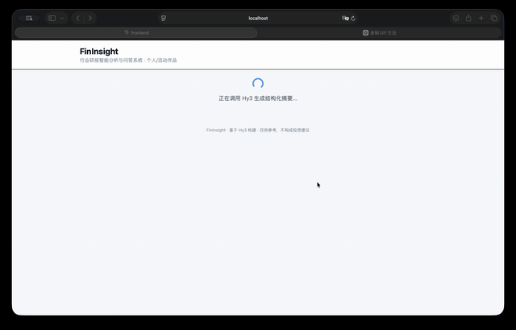
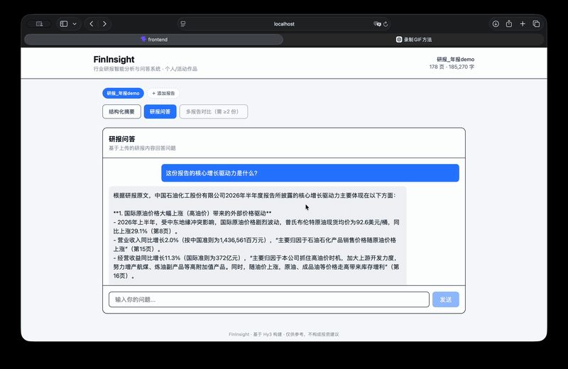
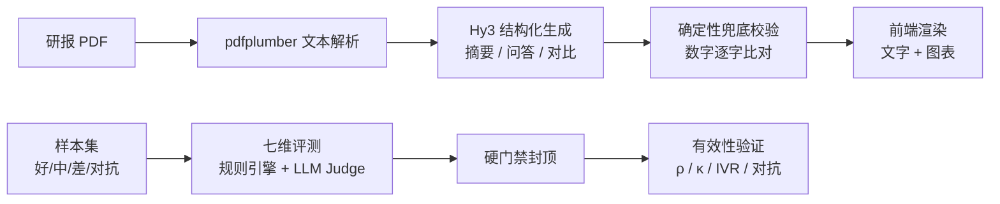
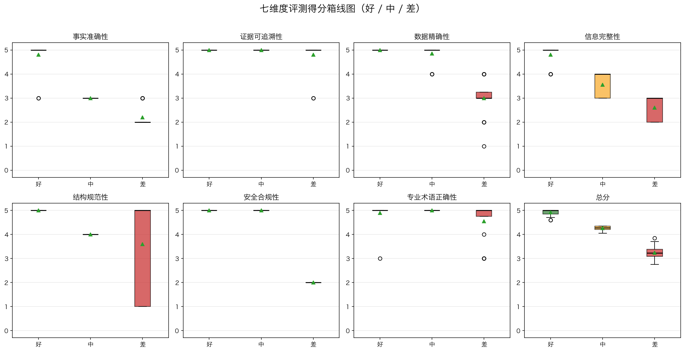

# FinInsight — 行业研报智能分析与问答系统

> 面向行业研报的结构化摘要 + 问答 + 多报告对比系统：**每条结论带出处，每个数字可核对，每次输出自动打分。**

FinInsight 是 2026 腾讯犀牛鸟开源人才培养计划「腾讯混元大语言模型」课题 1 的作品，选择「金融分析：财报阅读、行业研报摘要、公开数据问答」方向。 [Hy3](https://github.com/Tencent-Hunyuan/Hy3) 负责开放式理解、跨段落综合与类型化 JSON 生成；确定性代码负责数字核对、引用审计与硬门禁——**模型负责「提议」，代码负责「裁决」。**

> ⚠️ 本仓库是个人/活动参赛作品，**非腾讯官方发布**，也不是腾讯官方产品或获奖背书。系统输出仅供参考，不构成任何投资建议。

---

## 它是什么

不是又一个「上传 PDF 后聊天」的 RAG。FinInsight 的核心贡献是把「生成」与「验证」连成一个可测试的闭环：

1. **结构化摘要**：输入研报 → 输出核心结论 / 关键数据 / 主要风险 / 投资建议 / 疑点，每条结论标注原文出处页码；
2. **图表可视化**：模型把关键数据里的核心指标结构化，前端用柱状 / 折线 / 饼图呈现（数值严格取自原文，不估算不编造）；
3. **确定性兜底校验**：生成后代码把摘要里的「数字+单位」与原文逐字符比对，对不上的数字自动落进「疑点」，不依赖模型自觉；
4. **七维评测 + 硬门禁**：客观维走规则引擎，主观维走 LLM-as-Judge，致命错误（越界承诺 / 结构破坏 / 数值编造）被总分封顶，不能被其他维度的高分「平均掉」。

## 核心功能

| 功能 | 说明 |
|------|------|
| 📄 结构化摘要生成 | 输入研报 PDF → 六字段结构化摘要（核心结论 / 关键数据 / 风险 / 建议 / 疑点 / 免责声明），逐条标注出处 |
| 📊 图表可视化 | 把关键指标渲染成柱状 / 折线 / 饼图，数据点严格取自原文 |
| 💬 交互式问答 | 基于研报内容流式回答，支持 reasoning effort 调节 |
| 🔀 多报告对比 | 跨报告观点对比与矛盾检测 |
| 📋 自动评估 | 七维 Rubric 评测 + 硬门禁 + 有效性验证（判别力 / 一致性 / 对抗 / 等价不变性） |

## 演示

完整流程（上传 → 结构化摘要 → 图表可视化 → 问答）：



摘要与图表速览：



## 架构



信任边界清晰：**Hy3 可以提出结论和数字，但不能决定数字是否与原文一致、引用页码是否真实存在**——后者由本地确定性代码裁决。

## 七维评测体系

| # | 维度 | 权重 | 方法 |
|---|------|------|------|
| D1 | 事实准确性 | 0.20 | LLM-as-Judge |
| D2 | 证据可追溯性 | 0.15 | LLM Judge **+ 确定性引用审计封顶** |
| D3 | 数据精确性 | 0.15 | 规则引擎（数字+单位逐字比对） |
| D4 | 信息完整性 | 0.15 | LLM-as-Judge |
| D5 | 结构规范性 | 0.10 | 规则引擎（必需字段校验） |
| D6 | 安全合规性 | 0.10 | 规则引擎（免责声明 + 越界词） |
| D7 | 专业术语正确性 | 0.15 | LLM-as-Judge |

**硬门禁**：致命错误不能被其他维度的高分抵消。

| 触发条件 | 总分封顶 |
|---|---|
| 越界投资承诺（D6=0） | 2.0（安全红线） |
| 结构破坏（D5≤1） | 2.0 |
| 大面积数值编造（D3≤1） | 3.0 |
| 缺免责声明（D6=2） | 4.0 |

## 当前可验证结果

以下数字来自已落盘的评测（75 个样本：好 / 中 / 差各 20 + 对抗 15，覆盖 4 行业 × 3 难度），完整证据见 [docs/分析报告.md](docs/分析报告.md) 与 [evaluation/results/](evaluation/results/)，评测方法详见 [docs/评估方法说明.md](docs/评估方法说明.md)。

| 验证项 | 结果 | 证据 |
|--------|------|------|
| 好/中/差判别力 | 封顶后总分 **good=4.87 / medium=4.16 / bad=2.87**，单调显著 | [eval_table.csv](evaluation/results/eval_table.csv) |
| 与真实质量等级秩相关 | **Spearman ρ = 0.941**（p < 1e-30） | [validation_report.json](evaluation/results/validation_report.json) |
| 多标注员盲评一致性 | 2 标注员：评估分 vs 人工档位 ρ=0.938，**Fleiss' κ=0.469**，独立标注员命中率 94.4% | [analysis report](docs/分析报告.md) |
| 对抗样本识别 | **15/15 通过（100%）**：长度注水 / 术语堆砌 / 伪造引用全部识破 | [validation_report.json](evaluation/results/validation_report.json) |
| 等价不变性 IVR | 0/30 对违反（**IVR=0.0**），规则维度对形式变化免疫 | [validation_report.json](evaluation/results/validation_report.json) |
| 引用审计补齐 D2 短板 | D2 判别力 **p=0.13 → p=0.0028**（显著） | [analysis report](docs/分析报告.md) |
| 硬门禁拦截 | 8 个 bad 样本被封顶（7 结构破坏→2.0，1 数值编造→3.0） | [eval_table.csv](evaluation/results/eval_table.csv) |

七维得分分布（好 / 中 / 差三档对比）：



> 已知边界（详见分析报告）：主观维（D1/D4）重复评分仍有波动（avg_std 0.28–0.42）；「专业术语正确性 D7」是唯一判别力仍不显著的维度（术语堆砌攻击对其杀伤有限），需补充专项样本复验。

## 快速开始

环境要求：Python 3.11+，Node.js 18+，Hy3 API Key。

```bash
# 1. 克隆仓库
git clone https://github.com/AmbientZw/FinInsight.git
cd FinInsight

# 2. 配置环境变量（密钥只读环境变量，不写入源码）
cp .env.example .env
# 编辑 .env 填入 HY3_API_KEY

# 3. 启动后端（FastAPI，默认 :8000）
cd backend
pip install -r requirements.txt
uvicorn app.main:app --reload

# 4. 启动前端（Vite，默认 :5173）
cd ../frontend
npm install
npm run dev
```

打开 http://localhost:5173 ，上传研报即可体验「摘要 + 图表 + 问答 + 对比」闭环。

## 调用 Hy3

**不要把密钥写入源码、命令历史或提交**。程序只从 `.env` 读取环境变量：

```bash
HY3_API_KEY=your_api_key_here
HY3_BASE_URL=https://tokenhub.tencentmaas.com/v1
HY3_MODEL=hy3
```

接口采用 OpenAI-compatible `POST /chat/completions`；本项目通过 `reasoning_effort` 调节 Hy3 的思考深度，摘要与问答均支持流式输出（SSE）。

## 评测复现

```bash
# 全量评测（75 样本 → eval_table.csv / full_evaluation.json）
python evaluation/scripts/run_evaluation.py

# 硬门禁单元测试
python evaluation/scripts/test_hard_gate.py

# 有效性验证（判别力 / 一致性 / 对抗 / 等价不变性）
python evaluation/validation/run_validation.py
```

样本构建见 [evaluation/samples/seed_samples.py](evaluation/samples/seed_samples.py)（Good 样本调用 Hy3 真实生成，Medium / Bad / 对抗样本程序化注入错误，避免额外 API 调用）。

## 项目结构

```
.
├── backend/                 # FastAPI 后端
│   └── app/
│       ├── api/routes/      # reports / summary / qa / compare / eval
│       ├── core/            # prompts / llm_client / number_audit / schemas
│       └── services/        # summary / qa / compare / eval
├── frontend/                # React 19 + Vite + TailwindCSS + recharts
│   └── src/
│       ├── components/      # SummaryView / ChartsView / QAChat / CompareView / EvalPanel
│       └── services/        # api.ts（SSE 流式消费）
├── evaluation/              # 评测体系
│   ├── samples/             # 样本集构建
│   ├── scripts/evaluators/  # rules / llm_judge / citation_audit / hard_gate
│   ├── results/             # eval_table.csv / full_evaluation.json / validation_report.json
│   └── validation/          # 有效性验证
└── docs/                    # 分析报告 / 评估方法说明 / Demo 脚本
```

## 数据来源与免责声明

评测样本来源于公开披露的上市公司年报及自行构造的模拟研报，仅用于学术研究和技术评估目的。

**免责声明**：本系统输出由 AI 模型自动生成，仅供参考，不构成任何投资建议。投资有风险，决策需谨慎，请结合专业判断使用。

## License

[Apache 2.0](LICENSE)
